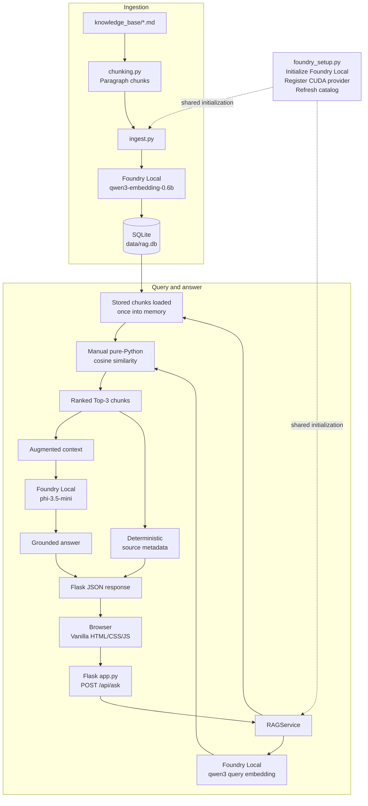

# Local RAG AI Assistant with Microsoft Foundry Local

A fully local Retrieval-Augmented Generation (RAG) knowledge assistant built with Python, Flask, SQLite, Microsoft Foundry Local, and vanilla HTML/CSS/JavaScript.

The application turns a small Markdown knowledge base into searchable embeddings, retrieves the three most relevant chunks for each question, and asks a local Phi model to answer from that retrieved context. The answer and its source metadata are returned separately: source filenames, chunk indexes, similarity scores, and content come deterministically from retrieval rather than being invented by the language model.

After the required execution-provider components and models have been acquired, embedding and generation inference run on the user's device. First-time provider and model acquisition can require an internet connection and can take substantially longer than later launches.

## Pipeline

```text
knowledge-base Markdown
-> paragraph chunking
-> qwen3 embeddings
-> SQLite persistence
-> query embedding
-> brute-force cosine similarity
-> Top-3 retrieval
-> augmented context
-> Phi-3.5 Mini
-> grounded answer + retrieval-source metadata
```

The implementation intentionally favors transparent, inspectable components over orchestration frameworks or a vector database.

## Architecture



## Technology and models

| Role | Technology |
| --- | --- |
| Web/API layer | Flask 3.1.3 |
| Frontend | Vanilla HTML, CSS, and JavaScript |
| Local inference | Microsoft Foundry Local SDK for Windows/WinML 1.2.4 |
| Embeddings | `qwen3-embedding-0.6b` |
| Generation | `phi-3.5-mini` |
| Persistence | Python `sqlite3` and a local SQLite file |
| Similarity | Manual pure-Python cosine similarity |
| Retrieval depth | Top-K = 3 |

The generation client uses temperature `0.0`, random seed `0`, and a maximum of 96 output tokens.

## Foundry Local and hardware acceleration

Production code requests models only by these aliases:

- Embedding: `qwen3-embedding-0.6b`
- Generation: `phi-3.5-mini`

[`foundry_setup.py`](foundry_setup.py) performs the shared initialization sequence:

1. Initialize `FoundryLocalManager` with `Configuration(app_name="foundry_local_rag")`.
2. Ask the installed SDK to download/register `CUDAExecutionProvider`.
3. Refresh the model catalog after provider registration.
4. Let Foundry Local resolve both model aliases normally.

No concrete CUDA model ID, device constraint, or `select_variant()` call is used. On the tested NVIDIA development laptop, alias resolution selected:

| Alias | Environment-specific resolved variant | Device/provider |
| --- | --- | --- |
| `qwen3-embedding-0.6b` | `qwen3-embedding-0.6b-cuda-gpu:1` | GPU / `CUDAExecutionProvider` |
| `phi-3.5-mini` | `Phi-3.5-mini-instruct-cuda-gpu:2` | GPU / `CUDAExecutionProvider` |

Those concrete IDs describe the tested environment; they are not application-level identifiers and must not be assumed on other machines. If CUDA registration fails, startup prints a warning and continues with normal alias resolution, allowing Foundry Local to select an available CPU-capable variant. CUDA is therefore an optimization, not a universal requirement.

The project uses the SDK directly and does not require the separate Foundry Local CLI.

## Repository structure

```text
.
|-- app.py                         # Flask page and API routes
|-- rag_service.py                 # Reusable retrieval and generation service
|-- foundry_setup.py               # Foundry initialization and CUDA registration
|-- ingest.py                      # Knowledge-base ingestion into SQLite
|-- chunking.py                    # Deterministic paragraph chunking
|-- evaluate.py                    # Reusable 15-case evaluation harness
|-- requirements.txt
|-- knowledge_base/                # Six Markdown documents searched by RAG
|-- data/
|   |-- rag.db                     # Production chunks and embeddings
|   `-- sqlite_demo.db             # Earlier SQLite learning artifact
|-- templates/
|   `-- index.html                 # Flask-served application page
|-- static/
|   |-- css/styles.css
|   `-- js/app.js
|-- demos/                         # Incremental educational/checkpoint programs
`-- evaluation/                    # Cases, runners, reports, and result evidence
```

The `demos/` directory preserves the project's learning progression: Foundry smoke testing, embeddings, SQLite, prompt engineering, retrieval, and the command-line RAG pipeline. Production behavior lives in the root application modules.

## Windows setup and running

### Prerequisites

- Windows with Python 3.11 or later. The final development environment used Python 3.14.7.
- An internet connection for initial Python package, execution-provider, and model acquisition.
- A compatible NVIDIA GPU is optional. Without usable CUDA acceleration, Foundry Local can resolve a CPU-capable variant, although measured CPU latency on the tested machine was much higher.

Clone the repository with its public Git URL (or download and open it), then open
PowerShell in the repository root and run:

```powershell
py -m venv .venv
.\.venv\Scripts\Activate.ps1
python -m pip install -r requirements.txt
```

The repository includes the final `data/rag.db`. Re-run ingestion when the database is absent or when the Markdown corpus has intentionally changed:

```powershell
python ingest.py
```

Ingestion replaces the current `chunks` rows with a freshly generated corpus; it does not append duplicates.

Start the local application:

```powershell
python app.py
```

Then open:

```text
http://127.0.0.1:5000/
```

The server binds only to `127.0.0.1`, disables Flask's development reloader, loads both models once, and reuses them across requests. On first use, provider/model downloads can take several minutes. On the tested laptop, normal startup with provider components and both models already cached was approximately **14.866 seconds**; this is a machine-specific observation, not a startup guarantee.

## HTTP API

The browser uses the same small local API exposed by [`app.py`](app.py).

### `GET /api/health`

```json
{
  "status": "ok"
}
```

This is a modest API status response, not detailed model or hardware telemetry.

### `POST /api/ask`

Request:

```json
{
  "question": "Why is SQLite suitable for this local project?"
}
```

Successful response:

```json
{
  "answer": "...",
  "sources": [
    {
      "source": "sqlite.md",
      "chunk_index": 1,
      "score": 0.81,
      "content": "..."
    }
  ]
}
```

Valid responses contain exactly three sources. `score` is a raw cosine-similarity value, not a confidence or probability. Missing, empty, whitespace-only, or non-string questions return JSON validation errors with HTTP 400. Unexpected internal failures return a generic JSON error with HTTP 500 while the exception is logged locally.

## Knowledge base and ingestion

The current corpus contains six Markdown files:

- `architecture.md`
- `embeddings.md`
- `foundry_local.md`
- `prompt_engineering.md`
- `rag.md`
- `sqlite.md`

[`chunking.py`](chunking.py) splits each document on blank lines, removes empty paragraphs, preserves order, and groups approximately two paragraphs per chunk. [`ingest.py`](ingest.py) discovers Markdown files in deterministic filename order, embeds all chunks in one batch with `qwen3-embedding-0.6b`, validates the vectors, and writes the complete run in a SQLite transaction.

The current database contains:

- 6 source documents
- 18 chunks
- 1024-dimensional embeddings
- JSON-serialized embedding vectors
- no duplicate `(source, chunk_index)` entries after repeat ingestion

The schema is:

```sql
CREATE TABLE chunks (
    id INTEGER PRIMARY KEY AUTOINCREMENT,
    source TEXT NOT NULL,
    chunk_index INTEGER NOT NULL,
    content TEXT NOT NULL,
    embedding TEXT NOT NULL
);
```

Ingestion clears the table and resets its autoincrement state before inserting the regenerated corpus. Document and query embeddings use the same model **alias**. A particular CUDA runtime is not required for semantic compatibility; Foundry Local may choose the appropriate concrete variant for the environment.

No vector database or SQLite vector extension is used.

## Retrieval

When `RAGService` starts, it reads and validates all stored chunks and embeddings once, then keeps them in memory for the server lifetime. Each question is embedded independently. The service calculates cosine similarity against every stored vector with plain Python:

```text
cosine_similarity(a, b) = dot_product(a, b) / (magnitude(a) * magnitude(b))
```

Zero-magnitude vectors are handled safely. Results are sorted from highest to lowest similarity, and the Top-3 retain their filename, zero-based chunk index, raw score, and content.

Brute-force ranking is appropriate here because the corpus has only 18 vectors and measured retrieval cost is roughly three milliseconds. A scalable vector index or vector database would become relevant only if the corpus grew substantially; neither is implemented in this project.

## Generation and grounding

The three retrieved chunks are formatted as augmented context and sent with the current question to `phi-3.5-mini`. The generic grounding instruction asks the model to:

- answer only with claims supported by the retrieved context;
- allow faithful paraphrasing when context is sufficient;
- avoid inventing causal or logical relationships between separate facts;
- keep supported answers concise;
- avoid generating source lists because the application already has retrieval metadata;
- return exactly the following sentence when the requested information is unavailable:

> The information is not available in the supplied context.

This behavior improves grounding but is not perfect: final exact-fallback compliance was 4/5, and manual review found occasional unsupported relationships and awkward wording.

Source metadata shown by the application is never requested from the model. It is carried directly from the ranked retrieval results, making the displayed evidence deterministic for a given retrieval result.

## Frontend

Flask serves a responsive, single-page interface implemented without a frontend framework or build step. It provides:

- a session-only chat-style transcript;
- independent RAG requests for every submitted question;
- a collapsible `3 sources` disclosure attached to each answer;
- source rank, filename, chunk index, similarity score, and retrieved content;
- light and dark themes, with operating-system preference and browser-local theme persistence;
- keyboard submission (`Enter`) and multiline input (`Shift+Enter`);
- loading, grounded-fallback, validation, retry, and technical-error states;
- responsive desktop and mobile layouts with normal document scrolling and a restrained sticky composer.

The transcript is presentation history only. Previous turns stay visible in the current page, but they are not sent to `/api/ask`, are not used as retrieval or model context, and are cleared by a page refresh. There is no backend conversation memory, saved conversation system, streaming response, authentication, upload flow, or analytics layer.

## Evaluation methodology

[`evaluation/evaluation_cases.json`](evaluation/evaluation_cases.json) contains 15 fixed natural-language questions:

- 10 answerable questions covering RAG, Foundry Local, embeddings, SQLite, prompt engineering, and architecture;
- 5 intentionally unanswerable questions covering facts absent from the corpus.

The evaluation records every generated answer, retrieved source and score, end-to-end query latency after initialization, and execution errors. Automated checks are intentionally narrow:

- **Retrieval Hit@1:** an expected source is ranked first.
- **Retrieval Hit@3:** an expected source appears anywhere in the Top-3.
- **Exact fallback:** an unsupported question returns the required sentence exactly and without additional text.
- **Latency:** average, median, minimum, and maximum query duration.
- **Case errors:** execution failures during the run.

Expected concepts are guidance for human review only. Semantic answer correctness is **not** automatically scored, no LLM judge is used, and this project does not claim 100% answer accuracy.

Historical artifacts preserve the baseline, controlled grounding-prompt tuning, chat-model comparison, CUDA experiment, and final production run:

- [Baseline evaluation](evaluation/baseline_report.md)
- [Grounding tuning comparison](evaluation/tuning_report.md)
- [Chat-model comparison](evaluation/model_comparison_report.md)
- [Empty-cache CUDA experiment](evaluation/empty_cache_cuda_report.md)
- [Final CUDA evaluation](evaluation/final_cuda_evaluation_report.md)
- [Final performance report](evaluation/final_performance_report.md)

## Final production evaluation

The frozen CUDA production system produced these results on the tested development laptop:

| Metric | Result |
| --- | ---: |
| Retrieval Hit@1 | 9/10 (90%) |
| Retrieval Hit@3 | 10/10 (100%) |
| Exact unsupported fallback | 4/5 (80%) |
| Case errors | 0 |
| Average query latency | 0.453 s |
| Median query latency | 0.341 s |
| Minimum query latency | 0.250 s |
| Maximum query latency | 0.982 s |

Average measured stage latency was:

| Stage | Average |
| --- | ---: |
| Query embedding | 0.036 s |
| In-memory retrieval | 0.003 s |
| Generation | 0.413 s |

These timings begin after service/model initialization and reflect one development laptop, its cached models, drivers, hardware, corpus, and evaluation prompts. They are measurements, not universal performance guarantees.

## Performance investigation

### CPU diagnosis and model comparison

The original CPU production path averaged approximately:

| Stage | CPU average |
| --- | ---: |
| Query embedding | 1.185 s |
| Retrieval | 0.004 s |
| Generation | 9.758 s |
| Total | 10.947 s |

Generation was the dominant bottleneck. A controlled CPU comparison tested the smaller `qwen2.5-0.5b` chat model against Phi with the same retrieval results, context, grounding prompt, and deterministic settings. Qwen's comparable average query latency was 2.068 seconds versus 9.716 seconds for Phi, but it achieved 0/5 exact unsupported fallbacks versus Phi's 4/5. Human review found invented ownership, vacation, deployment, and hardware answers, plus defects in several supported answers. Phi-3.5 Mini was therefore retained for this workload's better observed grounding behavior—not because Phi is universally superior.

### Alias-based CUDA acceleration

Diagnosis showed that historical cached CPU variants were influencing normal alias selection. In an isolated empty model cache, registering CUDA and refreshing the catalog caused the **same aliases** to select CUDA variants automatically. No concrete GPU variant was forced.

The controlled six-query CPU/CUDA timing comparison measured:

| Stage | CPU average | CUDA average | Reduction |
| --- | ---: | ---: | ---: |
| Query embedding | 1.185 s | 0.019 s | 98.44% |
| Retrieval | 0.004 s | 0.003 s | not a tuning target |
| Generation | 9.758 s | 0.562 s | 94.24% |
| Total | 10.947 s | 0.583 s | 94.67% |

Retrieval behavior remained stable across the 15 evaluation cases:

- same Top-1 source: 15/15;
- same Top-3 source set: 15/15;
- same Top-3 order: 15/15.

The optimization changed execution speed without changing the embedding/chat aliases, Top-K, retrieval algorithm, grounding prompt, API, or observed evaluation metrics. Exact improvements depend on hardware, drivers, available providers, model variants, and workload; they should not be generalized to every GPU system.

### Acquisition and startup costs

Provider/model acquisition and service startup are distinct from per-question latency. The tested machine measured:

| Operation | Measured time |
| --- | ---: |
| Initial CUDA provider acquisition/registration | 312.877 s |
| One-time embedding-model download | 89.570 s |
| One-time Phi-model download | 392.613 s |
| Subsequent CUDA registration | 4.931 s |
| Normal cached production startup | 14.866 s |

The one-time acquisition costs are not paid for every question. Cached production startup includes provider registration, catalog refresh, both model loads, and the SQLite read; the final query-latency measurements begin afterward.

## Engineering decisions

- **SQLite instead of an external vector database:** one local file is enough for an 18-chunk educational corpus and keeps setup inspectable.
- **Manual cosine similarity:** the formula and validation remain visible, with no NumPy or similarity-library dependency.
- **Top-K = 3:** Hit@3 reached 100%, while brute-force retrieval cost only a few milliseconds; no threshold, reranker, hybrid search, or larger context was justified.
- **No response cache:** the measured bottleneck was generation, and hardware acceleration reduced it without introducing cache invalidation or stale-answer behavior. Query embeddings are recomputed for each question.
- **Phi-3.5 Mini for generation:** it was slower than Qwen2.5-0.5B on CPU but materially better grounded in the controlled comparison.
- **Alias-based model resolution:** Foundry Local remains responsible for choosing environment-appropriate variants; production code does not hard-code CUDA IDs.
- **Flask plus vanilla frontend:** a lightweight local API and browser interface require no frontend framework or build system.
- **Retrieval-derived sources:** filenames, chunk indexes, scores, and content come from ranked chunks rather than model-generated citations.

## Testing and reproducibility

Run commands from the repository root with the virtual environment active.

### Routine checks

```powershell
# Command-line end-to-end RAG demonstration
python demos/rag_demo.py

# Flask test-client validation: health, request validation, valid RAG,
# unsupported fallback, response schema, model reuse, and cleanup
python evaluation/api_tests.py
```

### Current 15-case evaluation

```powershell
python evaluate.py
```

This initializes the service once, runs all 15 fixed cases, unloads the models, and writes `evaluation/evaluation_results.json` plus `evaluation/evaluation_report.md`. It overwrites those two general evaluation artifacts, so use a disposable working tree if the committed historical files must remain byte-for-byte unchanged.

Because production now contains the tuned grounding prompt and CUDA setup, running `evaluate.py` today evaluates the current frozen system; it does not recreate the historical pre-tuning CPU baseline. That original evidence remains in `evaluation/baseline_results.json` and `evaluation/baseline_report.md`.

The final instrumented production runner is retained at
`evaluation/final_production_evaluation.py`. It deliberately refuses to overwrite
the committed `final_cuda_results.json` and
`final_cuda_evaluation_report.md`. In a disposable copy where those output paths
are absent, run:

```powershell
python evaluation/final_production_evaluation.py
```

### Historical performance experiments

These scripts are evidence and engineering tools, not normal setup requirements:

- `evaluation/model_comparison.py` — controlled Phi/Qwen quality and latency comparison;
- `evaluation/warm_request_timing.py` — A1/A2/A3 and B1/B2/B3 stage timing;
- `evaluation/empty_cache_cuda_experiment.py` — isolated-cache alias/provider experiment;
- `evaluation/browser_regression.js` — retained headless-browser regression harness.

The empty-cache experiment can require large provider/model downloads and intentionally refuses to overwrite its committed artifacts. Users do not need to run any historical performance experiment to ingest documents or use the application.

## Limitations

- Exact unsupported-question fallback compliance is 80%, not 100%. One tested answer recognized that ownership information was unavailable but added a preface before the required sentence.
- Phi can occasionally combine supported facts into an unsupported causal or logical relationship. In the observed `rag_02` case, it linked embedding-model consistency to hallucination reduction more strongly than the retrieved text supported.
- Some responses can be awkward, incomplete, or contain minor text defects.
- The six-document, 18-chunk corpus is intentionally tiny and educational.
- Paragraph chunking is deterministic but simple: there is no overlap, token budgeting, semantic chunking, or structure-aware parsing.
- Brute-force retrieval is not intended for large document collections.
- The visible transcript is not conversational model memory; each question is independent.
- Exact results and latency depend on the selected Foundry Local variants and local hardware.
- CUDA acceleration requires compatible hardware and provider availability. CPU fallback was substantially slower on the tested machine.
- The local Flask server is a single-user development application; it does not implement authentication, document uploads, persistent conversations, or concurrent inference orchestration.

## Future improvements

The following are possible extensions and are **not implemented**:

- stronger grounded-fallback control and factuality checks;
- a larger and more diverse human-reviewed evaluation set;
- improved or structure-aware chunking;
- scalable vector indexing for larger corpora;
- further controlled local-model comparisons;
- optional document-management and ingestion UX.

## References

- [What is Foundry Local? — Microsoft Learn](https://learn.microsoft.com/en-us/azure/foundry-local/what-is-foundry-local)
- [Get started with Foundry Local — Microsoft Learn](https://learn.microsoft.com/en-us/azure/foundry-local/get-started)
- [Foundry Local SDK reference — Microsoft Learn](https://learn.microsoft.com/en-us/azure/foundry-local/reference/reference-sdk-current)
- [Foundry Local architecture overview — Microsoft Learn](https://learn.microsoft.com/en-us/azure/foundry-local/concepts/foundry-local-architecture)
- [Tutorial: Build a RAG application with Foundry Local — Microsoft Learn](https://learn.microsoft.com/en-us/azure/foundry-local/tutorials/tutorial-build-rag-app)
- [Retrieval augmented generation concepts — Microsoft Learn](https://learn.microsoft.com/en-us/azure/foundry/concepts/retrieval-augmented-generation?view=foundry-classic)
- [Microsoft Foundry samples — GitHub](https://github.com/microsoft-foundry/foundry-samples)
